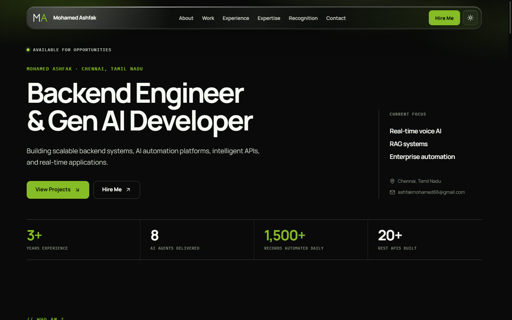

# Mohamed Ashfak — Portfolio

[](https://github.com/ashfakmohamed/port_folio/actions/workflows/deploy-pages.yml)

A responsive portfolio for **Mohamed Ashfak**, a Backend Engineer and Gen AI Developer focused on scalable APIs, RAG systems, AI automation, and real-time applications.

**[View the live portfolio](https://ashfakmohamed.github.io/port_folio/)**



## Highlights

- Responsive dark and light themes
- Backend, GenAI, and automation project presentation
- Experience, expertise, recognition, and contact sections
- Accessible navigation and semantic page structure
- Automated GitHub Pages deployment
- Data-driven content kept separate from UI components

## Technology

- React 18
- Vite 8
- JavaScript
- CSS
- Lucide React
- GitHub Actions and GitHub Pages

## Local development

```bash
npm install
npm run dev
```

Open the local URL printed by Vite.

## Quality checks

```bash
npm run lint
npm test
npm run build
```

## Project structure

```text
src/
├── components/   Reusable portfolio sections and UI
├── data/         Portfolio content and project data
└── main.jsx      Application entry point
```

## Deployment

Pushes to `main` trigger `.github/workflows/deploy-pages.yml`. The workflow installs dependencies, builds the Vite application, and deploys the generated `dist` artifact to GitHub Pages.

The Vite base path is configured for `/port_folio/` so JavaScript and CSS assets resolve correctly on project Pages.

## Contact

- [LinkedIn](https://linkedin.com/in/mohamed-ashfak/)
- [Email](mailto:ashfakmohamed66@gmail.com)
- [GitHub profile](https://github.com/ashfakmohamed)